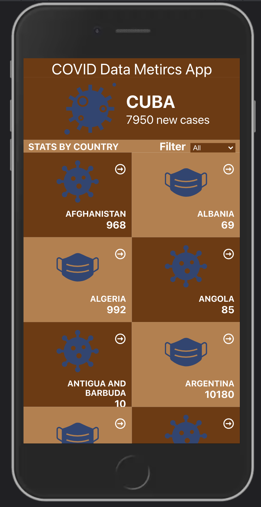

# React Capstone Project - Metrics Webapp

This React capstone project is about building a mobile web application to check a list of metrics (numeric values) that you will create making use of React and Redux.

I selected an API that provides numeric data about a topic that you like and then build the webapp around it. The webapp will have several pages:. I also learned how to apply JavaScript best practices and language style guides in code. We used AAA pattern for unit tests.
Write units tests for a JavaScript app and make JavaScript code asynchronous.
Most importantly we performed a code review for each team member. [Find project specifications here](https://github.com/microverseinc/curriculum-react-redux/blob/main/capstone/react_capstone.md)
      

<div align="center">

[](https://github.com/errea/react-capstone-project)
[](https://github.com/errea/react-capstone-project/issues)
[](https://github.com/errea/react-capstone-project/pull/1)

</div>

## Project description

This project is about building a mobile web application to check a list of metrics (numeric values) that you will create making use of React and Redux and also making a call from an API.

## Inner working

The application make API calls to the Narrativa API: COVID-19 data. retrieving information about the CONFIREMD, RETRIVED, DEATH, RECOVERED and TOTAL case of COVID mertic data of a region. First I choosed an API called [Narrativa API](https://covid19tracking.narrativa.com/index_en.html) to base the development of the mobileapp on. The API should allow you to get numeric values based on a parameter. Recommended that I choose an API that is open or needs an API key. If you choose an API that require authentication, you should implement it on your own.

## Built with

- HTML
- CSS
- JavaScript
- React & Redux
- React Components
- React Routes & props
- Stores, Actions and Reducers in React
- React DOM
- VSCode
- Linters
- Async/Await
- Babel
- JSON
- Virtual DOM
- Narrativa API
- Jest testing
- Webpack
- Kanban for Git project organization 
- [API Documentation](https://covid19tracking.narrativa.com/index_en.html)
- ES6 Modules 
- [Gitflow](https://github.com/microverseinc/curriculum-transversal-skills/blob/main/git-github/articles/gitflow.md)




## Getting Started <a name = "gs"></a>
> To get a local copy up and running follow these simple example steps.

### Get instructions

```
$ cd <folder>
```

~~~bash
$ git clone https://github.com/errea/react-capstone-project.git
$ cd react-capstone-project
~~~

Run `npm install` to install the node modules and webpacker.

Run `npm run build` to build the bundler and build the webpack.

Run `npm run start` on a Terminal to start the server and look at the result in `http://localhost:8080/` in your browser.


## [LIVE PREVIEW](https://react-capstone-webapp-matrics.netlify.app/)


## [LINK TO LOOM VIDEO](https://www.loom.com/share/68d3304d422c434bac972d079db4cf6c)

## API Information

### Narrativa API

- For getting the list of COVID data metrics, the [Narrativa API](https://covid19tracking.narrativa.com/index_en.html) was used.

- One methods were implemented: To get a list of COVID data Metrics. 

- The base URL for searching the COVID metrics: `https://api.covid19tracking.narrativa.com/api/`.

- The base URL for getting information for a counrty `'https://api.covid19tracking.narrativa.com/api/2020-03-22/country/spain' + ?date_from=2020-03-20&date_to=2020-03-22;` where id is the date.

- The result of calling this API is an array containing several fields which can be queried using dot notation.

#### New app

- To create a app, send a GET action to the base URL + `/apps/` without any parameter:

- The result will be the code for the further API calls: 

#### COUNTRIES

- To get a list of all likes for all the items (movies), send a GET action to the base URL + `[/apps/:app_id/likes/](https://api.covid19tracking.narrativa.com/api/2020-03-22/country/spain)`:

- The response will be something like:

```
[
  "dates": {
        "2020-03-22": {
            "countries": {
                "Spain": {
                    "date": "2020-03-22",
                    "id": "spain",
                    "links": [
                        {
                            "href": "/api/2020-03-22/country/spain",
                            "rel": "self",
                            "type": "GET"
                        }
                    ],
                    "name": "Spain",
                    "name_es": "España",
                    "name_it": "Spagna",
                    "regions": [
                        {
                            "date": "2020-03-22",
                            "id": "castilla-la_mancha",
                            "links": [
                                {
                                    "href": "/api/2020-03-22/country/spain/region/castilla-la_mancha",
                                    "rel": "self",
                                    "type": "GET"
                                }
                            ],
                            "name": "Castilla-La Mancha",
                            "name_es": "Castilla-La Mancha",
                            "name_it": "Castilla-La Mancha",
                            "source": "John Hopkins University",
                            "sub_regions": [
                                {
                                    "date": "2020-03-22",
                                    "id": "ciudad_real",
                                    "name": "Ciudad Real",
                                    "name_es": "Ciudad Real",
                                    "name_it": "Ciudad Real",
                                    "source": "Consejería Salud Castilla-La Mancha",
                                    "today_confirmed": 505,
                                    "today_deaths": 40,
                                    "today_new_confirmed": 0,
                                    "today_new_deaths": 0,
                                    "today_vs_yesterday_confirmed": 0.0,
                                    "today_vs_yesterday_deaths": 0.0,
                                    "yesterday_confirmed": 505,
                                    "yesterday_deaths": 40
                                },
                                {
                                    "date": "2020-03-22",
                                    "id": "albacete",
                                    "name": "Albacete",
                                    "name_es": "Albacete",
                                    "name_it": "Albacete",
                                    "source": "Consejería Salud Castilla-La Mancha",
                                    "today_confirmed": 430,
                                    "today_deaths": 32,
                                    "today_new_confirmed": 0,
                                    "today_new_deaths": 0,
                                    "today_vs_yesterday_confirmed": 0.0,
                                    "today_vs_yesterday_deaths": 0.0,
                                    "yesterday_confirmed": 430,
                                    "yesterday_deaths": 32
                                },
                                {
                                    "date": "2020-03-22",
                                    "id": "toledo",
                                    "name": "Toledo",
                                    "name_es": "Toledo",
                                    "name_it": "Toledo",
                                    "source": "Consejería Salud Castilla-La Mancha",
                                    "today_confirmed": 501,
                                    "today_deaths": 28,
                                    "today_new_confirmed": 0,
                                    "today_new_deaths": 0,
                                    "today_vs_yesterday_confirmed": 0.0,
                                    "today_vs_yesterday_deaths": 0.0,
                                    "yesterday_confirmed": 501,
                                    "yesterday_deaths": 28
                                },
]
``` 

## ✒️  Authors <a name = "author"></a>

👤 **Eri**

- Github: [@errea](https://github.com/errea)
- Twitter: [@Erreakay](https://github.com/errea)
- Linkedin: [Eri Okereafor](https://www.linkedin.com/in/eri-ngozi-okereafor/)

## 🤝 Contributing

Contributions, issues and feature requests are welcome!

Feel free to check the [issues page](https://github.com/errea/api-based-webapp/issues)
## 👍 Show your support

- Microverse: [@microverse](https://www.microverse.org/)

## Acknowledgments

- Microverse
- Narrativa [COVID-19 TRACKING PROJECT](https://covid19tracking.narrativa.com/index_en.html)
- Original design idea by [Nelson Sakwa on Behance](https://www.behance.net/sakwadesignstudio).

## 📝 License

This project is MIT licensed.